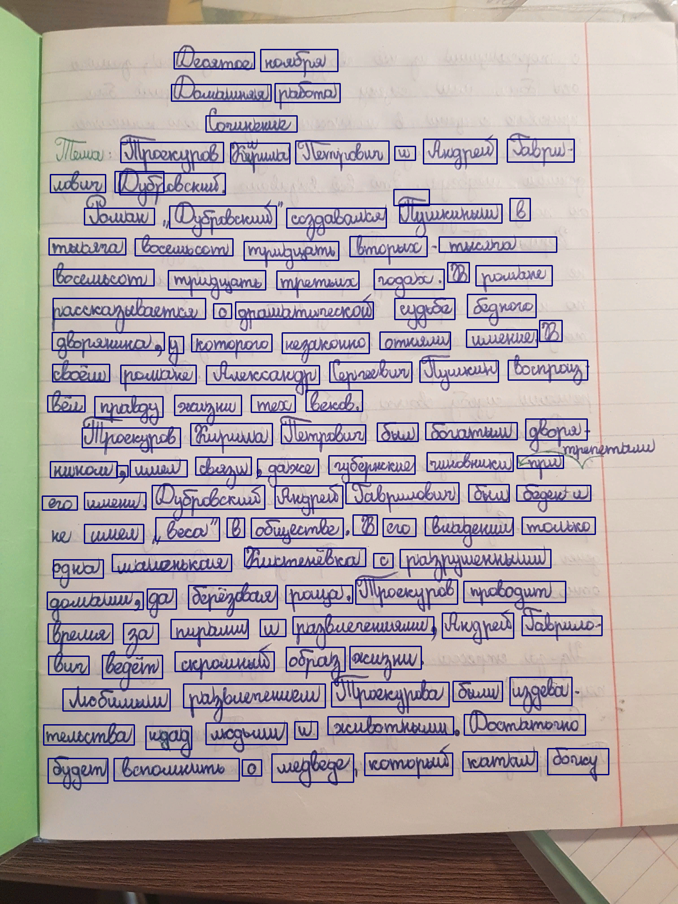
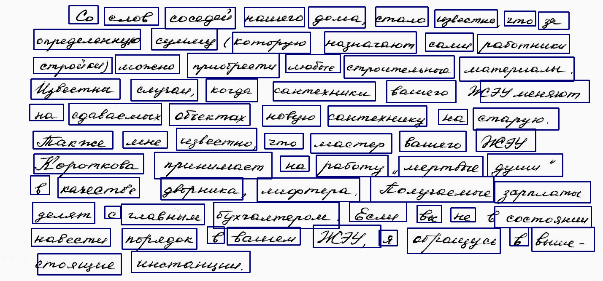

# WordDetectorYolo5


https://trello.com/b/osfWA0YS/eye-text


https://habr.com/ru/companies/contentai/articles/749974/


** ДАТАСЕТ 0 для чисел: ** https://www.kaggle.com/datasets/hojjatk/mnist-dataset/download?datasetVersionNumber=1


https://drive.google.com/drive/folders/1RBQPhUF1sR4jLH8HVIZCvdS3r1yzxr9L?usp=sharing


** ДАТАСЕТ 1 для слов: ** https://www.kaggle.com/datasets/constantinwerner/cyrillic-handwriting-dataset/download?datasetVersionNumber=4


https://drive.google.com/drive/folders/1EICsZCpVGnZ7dqGplR-v_cwGWP-VgMys?usp=sharing


** ДАТАСЕТ 2 для опечаток: ** https://huggingface.co/TopCoderTv/eye_text/tree/main


https://drive.google.com/drive/folders/1t9epVVjm-wvQ9CEEeVpdC1aTsGLPMVuK?usp=sharing


** ДАТАСЕТ 3 для аббревиатур: ** https://www.kaggle.com/datasets/xhlulu/medal-emnlp/download?datasetVersionNumber=4


https://drive.google.com/drive/folders/17BQFUOHJvsdJlDdtUcIJG4mkm6jzPdfo?usp=sharing


** DOCKER: ** https://www.youtube.com/watch?v=i4XlApdCuc8


** BIOS: ** https://pacificsky.ru/virtualization/docker/111-docker-zapusk-docker-na-windows-bez-hyper-v.html


# Handwritten Word Detector with YOLOV5
Detect handwritten words with YOLOV5

## Demo

<p float="left">


</p>

## Installation
- `git clone https://github.com/kos94ok/WordDetectorYolov5.git`
- `cd WordDetectorYolov5`
- `pip install -r requirements.txt`
-  Download [pretrained model](https://huggingface.co/docs/transformers/model_doc/trocr), and place the unzipped files into the ckpt directory


## Usage 
```python
import torch
import cv2
import numpy as np
import words

image = cv2.imread("test/img_24.png")

model = torch.hub.load('yolov5', 'custom', path='ckpt/best_4_finetunning.pt', source='local', device='cpu')
model.conf = 0.5
model.size = 320

predictions = model(image)
crops = predictions.crop(save=False)

#Normalization
boxes = []
for crop in crops:
  boxesList = crop['box']
  boxArray = []
  for box in boxesList:
    boxArray.append(int(box))
  boxes.append(boxArray)
  
 # Sorting words from left to right
 lines = words.sort_words(np.array(boxes))

#Show results
for line in lines:
  textImageROI = image.copy()
  for (x1, y1, x2, y2) in line:
    cv2.rectangle(image, (x1, y1), (x2, y2), 125, 2)
    cv2.imshow('Image', image)
    cv2.waitKey()
```
